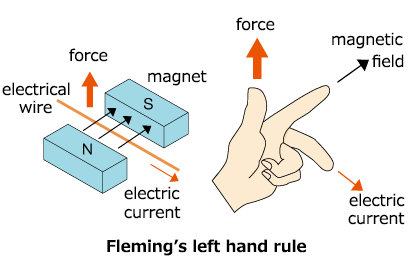
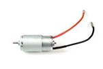
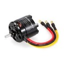
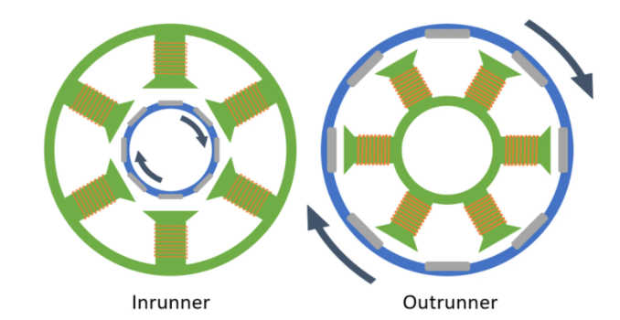
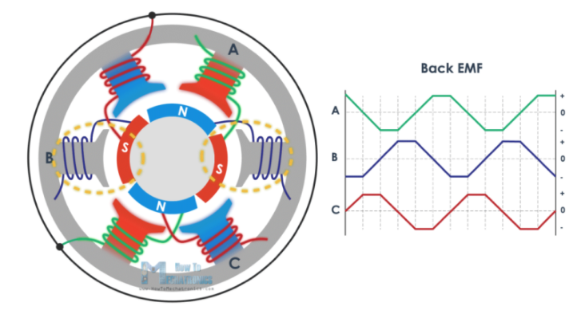

=================================================================================================================
Mini Sınıfı Döner Kanat ve Sabit Kanat İHA’lar için Elektrik Motoru Detaylı Bilgilendirme ve Seçim Dokümantasyonu
=================================================================================================================

Elektrik motorları, elektrik enerjisini mekanik enerjiye dönüştüren makinelerdir. Bu dönüşüm motordaki mıknatısların oluşturduğu manyetik alan ve bobinlere sarılı tellerden geçen akımın oluşturduğu elektrik alan arasında oluşan kuvvetle sağlanmaktadır. Bu ilişki Fleming'in sol el kuralı ile açıklanabilir [1]; daha iyi anlaşılması için Şekil 1 incelenmelidir.

       
Fleming'in Sol El Kuralı
  
Elektrik motorları sahip oldukları özelliklerine göre birçok farklı kategoride incelenebilirler. Bu kategoriler motora sağlanan güç tiplerine, motorun iç yapısına, kullanım amacına göre adlandırılmaktadır. Örnek olarak alternatif akım veya düz akım, fırçalı veya fırçasız, tek fazlı, çift fazlı veya üç fazlı gibi kategoriler gösterilebilir.

Mini İHA’larda genel olarak fırçasız DC (Direct current, Düz akım) elektrik motorları kullanılmaktadır. Bu motorlar yüksek verimlilikleri, istenilen tork değerinin motor sürücüler ile sağlanabilmesi, oldukça hafif olmaları, boyutlarının küçük olması, temiz enerji kaynaklarından üretilen elektrik enerjisiyle çalışıyor olabilmeleri gibi nedenlerden dolayı tercih edilmektedirler. Fırçalı motorlar direk DC bir kaynaktan çalışabilseler de fırçasız motorlar daha verimli olduklarından tercih edilmektedir. Gelişen teknolojiyle fırçasız motorları sürmek için gereken motor sürücüler ucuzlamış ve fırçasız motorların kullanımını yaygınlaştırmıştır. Şekil 2 ve 3’te bu tiplere örnek motorlar gösterilmiştir.

Fırçalı Motor

Fırçasız Motor

Fırçasız DC motorların motorun dönen kısmının içerde (Inrunner) veya dışarda (Outrunner) olduğu tipleri mevcuttur. İçten dönen motorlar dıştan dönen motorlara kıyasla verimlilikleri daha fazladır ve ısı dağılımları daha iyidir. Ancak pervanelerde kaldırma kuvveti oluşturabilmek için gerekli dönüş hızını sağlayacak tork değerleri dıştan dönen motorlarda daha fazladır [3]. Bu nedenle Mini İHA’larda dıştan dönen fırçasız DC motorlar tercih edilmektedir. Dıştan dönen motorlarda bobinler motorun sabit olan iç kısmında (stator), mıknatıslar ise motorun dönen kısmı olan (rotor) kısmında yer alır.

      
İçten ve Dıştan Dönen Fırçasız DC Motorlar 

Fırçasız motorlar fırçalı motorlardaki gibi doğrudan bir DC güç kaynağı ile çalışamazlar. Sabit bir tork üretebilmek için Şekil 5’te de görüldüğü gibi elektrik geriliminin motorun faz kablolarına değişimli olarak uygulanması gerekmektedir. Bu çalışma mantığının daha iyi anlaşılması için animasyonlar izlenebilir [6]. Fırçasız motorlar değişen bu gerilimin sağlanabilmesi için bir sürücüye ihtiyaç duyarlar. Bu sürücü devresine Elektronik Hız Kontrolcüsü (Electronic Speed Controller) denmektedir. Elektronik hız kontrolcüleri detaylı bir şekilde ayrı bir başlıkta ele alınacak olup Şekil 6’de örnek olarak görülmektedir.

        
Faz Kablolarına Uygulanan Gerilim Grafiği

Fırçasız DC motorların sahip olduğu önemli özellikleri bulunmaktadır. İHA’mıza en optimize motoru seçebilmek için bu özellikler iyi bilinmeli, İHA’mızın gerçekleştireceği göreve göre uygun motor seçilmelidir.

Özellikler
~~~~~~~~~~
İtki (Thrust)
=============
Genellikle motor seçimlerinde göz önüne alınan birincil faktördür. Hava aracımız döner veya sabit kanat fark etmeksizin uçabilmesi için gerekli bir itkiye ihtiyacı vardır. İtki bir kuvvettir, birimi Newton’dur. Motor veri sayfalarında (datasheet) itki genellikle gram (gr) cinsinden belirtilir. Örnek bir veri sayfası şekil 8’de görülmektedir. Gram kütle birimi olsa da dönüşüm yapmadan daha kolay anlaşılması için tercih edilmektedir. İtki değeri sadece motora bağlı bir parametre olmayıp motora bağlanan pervanenin ölçülerine ve motora uygulanan gerilime göre değişmektedir. Motor seçiminde dikkat edilmesi gereken itkiyi değiştiren ana parametreler bunlar olup motorun çalıştığı havanın yoğunluğu ve pervanenin ham maddesi gibi unsurlara da bağlıdır.

Döner kanatlı İHA’larda kaldırma kuvveti motorların sağlayacakları toplam itki kuvvetine eşit olacağı için kalkış ağırlığımızdan daha fazla olmalıdır. İstenilen toplam itki, itki ağırlık oranı ile belirlenir. İtki ağırlık oranı İHA’mızın sahip olduğu itki kuvvetinin İHA’mızın toplam ağırlığına oranıdır. Bu oran İHA’nın isterlerine göre değişmektedir. Şekil 7 de belirtildiği gibi kullanım amacına göre bu oran değişmektedir. Genel olarak kabul gören bu oran %50 itki ile (Yarım gaz) döner kanatlı İHA’nın havalanabilmesidir. Orta ve şiddetli rüzgârda dahi uçabilmesi istenilen, atik manevralar yapabilmesi gereken döner kanatlı bir İHA’nın ise yaklaşık 2.5 itki ağırlık oranına sahip olması gerekmektedir. Sabit kanatlı İHA’larda bu oranın belirlenebilmesi daha karmaşık olup ayrı bir başlıkta incelenmelidir. Kabaca optimize bir oran olmasa da yine orta ve şiddetli rüzgarlarda uçması, atik manevralar yapabilmesi istenilen bir sabit kanat Mini İHA’nın yaklaşık 0.8 itki ağırlık oranına sahip olması gerekmektedir.

Belirlenen itki ağırlık oranından sonra istenilen itkiyi sağlayacak motor seçiminde birçok motor incelenmelidir. Bu araştırmada motor satıcılarının sundukları veri sayfalarından yararlanılmaktadır. Bu veri sayfaları incelenirken dikkat edilmesi gereken hususlar motorumuzu hangi pervane ile kaç S’lik pil ile çalıştırmayı düşündüğümüzdür. Bu seçimler ile motorun itki ve verim değerleri de değişmektedir. Bulduğumuz itki ağırlık oranımızdan elde ettiğimiz itki değerimiz %100 gaz verildiği zaman elde edilmesi gereken veri olmalıdır. Hava aracımız genellikle uçuş sırasında bu değerin altında çalışacaktır. Yine bu tablodan alınan akım değerleri ile ortalama uçuş süresi hesabı yapılacak olup ayrı bir başlıkta incelenecektir.

Motor Boyutu
============
Fırçasız DC motorların boyutları 4 haneli sayılar ile gösterilmektedir. XXYY şeklinde motorların isimlerinde yer alana ifadelerle ihtiyaç olan motorun daha hızlı seçilmesi sağlanmaktadır. XXYY sayısındaki XX motor statorunun genişliğini, YY kısmı ise stator yüksekliğini göstermektedir. Bu değerler milimetre olarak verilmektedir. Motorun bu boyutlara bağlı değişen özellikleri olup seçim aşamasında bu değerler kolaylık sağlamaktadır.

Öncelikle bu iki değerin de fazla olması motorun sağlayacağı maksimum tork değerini arttırmaktadır. Yine motorlar büyüdükçe üretebilecekleri itki değerleri de artmaktadır. YY sayısının büyümesi yani motorun daha uzun bir statora sahip olması maksimum dönüş hızını arttırırken düşük hızlardaki performansını azaltmaktadır. XX sayısının büyümesi yani daha geniş bir statora sahip olunması daha düşük bir maksimum hız sunarken düşük hızlardaki performansını arttırmaktadır.

Daha uzun statora sahip motorlarda daha büyük bir yüzey alanı vardır. Bu nedenle daha fazla manyetik alan kesebilir. Yine daha geniş yüzey alanına sahip olmasıyla ısı dağılımı da daha iyidir. Daha geniş statora sahip motorlar daha yüksek torklu ve daha verimlidirler.

KV Değeri
=========
KV değeri sadece fırçasız elektrik motorları için geçerli olan bir devir katsayısıdır. KV değeri kullanılarak bir fırçasız motorun bir dakikadaki yüksüz devri ile motora verilen voltaj kabaca ilişkilendirilebilir. Daha basitçe söylersek, bir fırçasız motorun KV değeri, 1 Volt için 1 dakikada çevireceği devirdir (RPM sayısı). Örneğin 1200 KV'lik bir motor, yüksüz durumda, yani pervane bağlı değilken 7.2 Volt verildiğinde dakikada 1200 x 7.2 = 8640 devirle dönecektir. Aynı motora 11.1 Volt verirseniz dakikada 1200 x 11.1 = 13320 devir, başka bir deyişle 13320 RPM (“Revolutions per Minute”) ile döner. Genel olarak yapılan yanlış KV değerini 'kilovolt' olarak okumaktır. Kilovolt 1000 Volt demektir ve kV şeklinde yazılır. KV ile alakası yoktur. Pervaneyi motora takınca hava direncinden dolayı motorun pervane takılmamış haline göre RPM’de önemli derecede bir düşüş olmaktadır.

Yüksek KV yüksek RPM demektir. Yüksek KV değerine sahip motorlar pervaneyi daha hızlı döndürür ve daha fazla akım çekebilir. Genel olarak yarış dronlarında çoğunlukla 3 palli ve küçük pervaneler seçilir. Film çekilen veya farklı görevleri olan dronlarda ise düşük KV değerli motorların yanında büyük pervaneler kullanılır. Mıknatısların manyetik güçlülüğü de KV değerini etkileyen faktörler arasındadır. Güçlü mıknatıslar KV’yi arttırır.

Eğer yüksek KV değerine sahip bir motora geniş pervane takılırsa motor sanki küçük bir pervane takılmış gibi yüksek hızda pervaneyi döndürmeye çalışacaktır. Bu durum da daha çok tork gerektirir. Motor gereken torku üretmek için daha fazla akım çeker ve sonuç olarak çok fazla ısınır ve bu durum motorun yanmasına sebebiyet verir. Motorun yanmasının sebebi motorun içindeki bobinin üzerindeki kaplamanın erimesi ve sonucunda motorun içinde kısa devreler oluşmasıdır.

Motor Torku
===========
Motorun torku ile KV değeri arasında zıt bir ilişki vardır. Yüksek KV değerine sahip motorlar düşük tork değerlerine, düşük KV değerine sahip motorlar yüksek tork değerlerine sahiptirler. Yüksek KV değerine sahip motorlar düşük KV değerine sahip motorlara göre aynı torka ulaşmak için daha fazla akıma ihtiyaç duyarlar.

Tork motorun RPM’ini ne kadar hızlı şekilde azaltıp arttırabildiğinin ölçüsüdür. Başka bir deyişle motorun rotorunu, pervanesini ve en önemlisi havayı ne kadar kolay hareket ettirdiğinin bir ölçüsüdür. Tork, hava aracımızın uçuş performansının ne kadar hassas ve duyarlı olduğunu önemli ölçüde etkiler. Tork değerini etkileyen şeyler:

-  Stator boyutu: daha büyük daha fazla tork
-  Materyaller: mıknatısların tipi, bakır sarımların kalitesi
-  Motorun yapısı: hava boşluğu, kutupların sayısı gibi şeyler

Tork iki taraflı bıçak gibidir yani uç değerlerde değil de ortalama ideal değerlerde olması istenir. Biraz daha açacak olursak yüksek tork değerine sahip motorlar RPM hızındaki değişiklere daha hızlı bir şekilde cevap verir ve böylece anında ve çabuk tepkiler verebilir ancak aynı zamanda dron kullanımında daha keskin ve robotik bir hisse yol açar. Düşük tork değerine sahip motorlarda ise durum tam tersidir yani uçuş esnasında daha yumuşak tepkiler alınmasını sağlamasına rağmen RPM hızındaki değişikliklere çok hızlı cevap veremez (ani ivmeli manevralar gerektiren hareketler).

Tork Sabiti (Kt değeri)
=======================
Kt değeri, fırçasız elektrik motorlarındaki tork katsayısıdır. Kt değeri bize bir fırçasız motorun amper başına vereceği torku ounce-inch (oz-in) cinsinden verir. Örneğin Kt değeri 0.45 oz-in/A olan bir motor 5 amper akım çekiyorsa 0,45*5 = 2.25 ounce-inch yani 162.017 gram-santimetre tork veriyor demektir. Aynı miktarda tork üretmek için yüksek Kt değerine sahip olan bir motor, düşük Kt değerine sahip olana göre daha az akım çeker.

Verimlilik 
==========
Motor verimliliği hava aracının uçuş performansını etkileyen bir unsurdur. Verimlilik arttıkça uçuş süresi ve motor ömrü artmaktadır. Hava aracının uçuş agresifliği verimliliği etkileyen bir faktördür. Ani ve ivmeli hareketlerle uçacak bir hava aracının uçuşunda motor yüksek akımlar çekecek, verimliliği ve pil ömrü de azalacaktır. Düşük gerilimlerde ise verim artar ancak itki azalır.

Verimlilik konusunda bir başka dikkat edilmesi gereken husus ise motorun çalıştığı voltaja ve çektiği akım değerine göre verimliliğin değişmesidir. Genellikle motor zorlanırken veya uç değerlerdeyken yani artık çekebileceği maksimum akımı çekmeye başlamışsa verimliliği düşer. Bu konuda motorun maksimum thrust (itki)’si hesaplanırken uç değerlerde verimliliği ile normal değerlerdeki verimliliği arasında çok ciddi fark olmamasına dikkat edilmelidir.

Motor Kutup ve Mıknatısları
===========================
Motorların sahip oldukları bobin ve mıknatıs sayıları XXNXXP ifadeleri ile gösterilmektedir. N’den önceki sayı statorda bulunan bobinlerin sayısını gösterirken, P’den önceki sayı motorun dönen dış bölgesindeki mıknatısların sayısını göstermektedir.

Farklı boyutlardaki motorlar farklı sayılarda kutuplara sahip olsalar da 22xx ve 23xx motorlar genellikle 12 kutpa ve 14 mıknatısa sahip olurlar.

Kutuplar arasındaki mesafeyi kutup sayısı belirler. Eğer daha az kutup varsa statorun içi daha çok demir bileşenle kaplanabilir. Ancak fazla sayıda kutup ile manyetik alan daha eşit şekilde yayılır ve rotorun dönüşü üzerine daha çok kontrol sahibi olunduğundan daha pürüzsüz dönen bir motor elde edilmiş olur. Daha fazla kutup daha pürüzsüz dönüş sağlarken, daha az kutup daha güçlü motor anlamına gelir.

Kutup sayısı 3’ün katları şeklinde olmak zorundadır çünkü incelediğimiz fırçasız motorlar 3 fazlıdır. Bu yüzden kutup sayıları 3, 6, 9 … şeklinde olmalıdır.

Yardımcı Bilgiler
~~~~~~~~~~~~~~~~~~
CW ve CCW Motorlar
==================
Bazı motorlar CW veya CCW olarak satılmaktadırlar. Bu motorlar diğer motorlarla aynı olmakla birlikte tek farklılıkları pervanenin takıldığı motor başının yuvalı yapılmış olmasından dolayı pervanelerin el yardımıyla döndürülerek kolayca motora takılabilmesidir. Bu motorlar kullanılırken kullanılan motorun ve takılacak pervanenin dönüş yönlerine dikkat edilmelidir. Pervanelerin dönüş yönlerinin kolay anlaşılması için baş kısımlarında siyah, beyaz, gümüş gibi renkler bulunmaktadır. Bu kullanım şeklinde pervaneler motorlar döndükçe sıkışacak şekilde bağlandıkları için hem güvenli hem de kullanımı basit bir yöntemdir.

Döner Kanatlı İHA’larda Motor Büyüklüğünün Belirlenmesi
=======================================================
Motor büyüklüğüne karar verilirken öncelikle kullanılacak şasenin boyutu belirlenmelidir. Bu şaseye uygun olan pervane boyutuna göre tablo da önerilen motor boyutları ile motor araştırmasına başlanabilir. Verilen tablo 4S’lik bir pil kullanımı varsayılarak hazırlanmıştır.

Motor ESC Bağlantısı
====================
Motorları ESC’ye bağlarken istenilen sıraya göre bağlamakta herhangi bir sorun yoktur. Eğer motor istenen yöne dönmüyorsa herhangi iki bağlantının yeri değiştirilip motorun istenen yöne dönmesi sağlanabilir. Aynı zamanda bazı ESC’lerde ESC ayarlarından da bunu ayarlamak mümkündür.

Referanslar:
~~~~~~~~~~~~~
[1] Fleming’in Sol El Kuralı. Erişim adresi:
 https://en.wikipedia.org/wiki/Fleming%27s_left-hand_rule_for_motors
 
[2] Fleming'in Sol El Kuralı, Şekil 1 [dijital görsel]. Erişim adresi:
 https://www.yaskawa-global.com/product/mc/about-motor

[3] Fırçalı ve fırçasız motorların karşılaştırılması. Erişim adresi:
 https://www.radiocontrolinfo.com/brushless-inrunner-vs-outrunner-motor/

[4] İçten ve Dıştan Dönen Motorlar, Şekil 4 [dijital görsel]. Erişim adresi:
 https://www.rcbenchmark.com/blogs/articles/how-brushless-motors-work

[5] Faz Kablolarına Uygulanan Gerilim Grafiği, Şekil 5 [dijital görsel]. Erişim adresi:
 https://howtomechatronics.com/how-it-works/how-brushless-motor-and-esc-work/

[6] Fırçasız Motorlar Çalışma Mantığı. Erişim adresi:
 https://www.youtube.com/watch?v=uOQk8SJso6Q&t=54s&ab_channel=HowToMechatronics

[7] Örnek Elektronik Hız Kontrolcüsü, Şekil 6 [dijital görsel]. Erişim adresi:
 https://www.hobbywing.com/goods.php?id=407&filter_attr=6345.6463

[8] Örnek Motor Veri Sayfası, Şekil 8 [dijital görsel]. Erişim adresi:
 https://store-en.tmotor.com/goods.php?id=587

[9] İtki Ağırlık Oranı Tablosu, Şekil 7 [dijital görsel]. Erişim adresi:
 https://cheap.ebuy2021.com/content?c=drone%20power%20to%20weight%20ratio&id=3

[10] Motor İç Görünümü, Şekil 9 [dijital görsel]. Erişim adresi:
 https://oscarliang.com/quadcopter-motor-propeller/

Genel Olarak Faydalanan Kaynaklar:
~~~~~~~~~~~~~~~~~~~~~~~~~~~~~~~~~~
 https://oscarliang.com/quadcopter-motor-propeller/#balancing

 https://oscarliang.com/propeller-shaft-adapter-nuts-cw-ccw/

 https://www.quora.com/On-electric-motors-can-anyone-explain-in-laymans-terms-what-turns-means-e-g-9-turn-motor

 https://www.groschopp.com/how-to-calculate-your-torque-constant/
